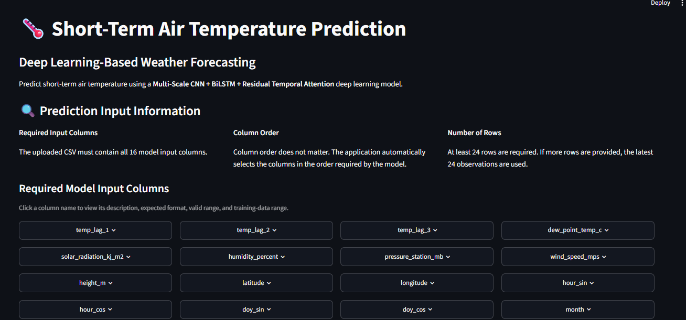
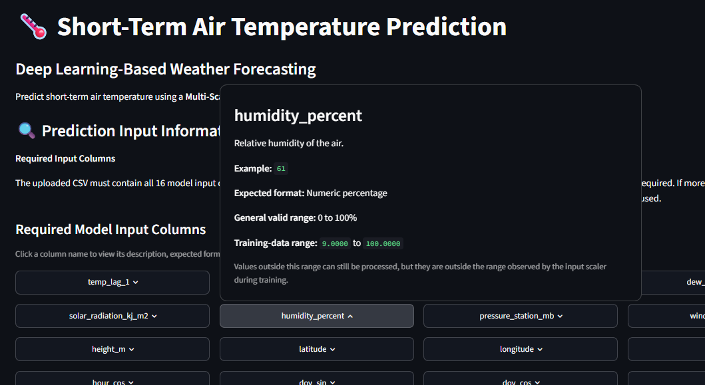
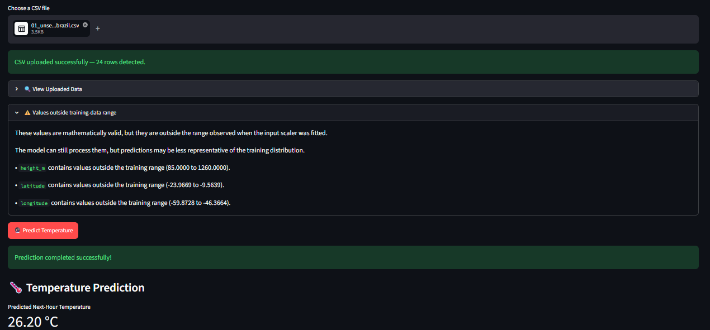
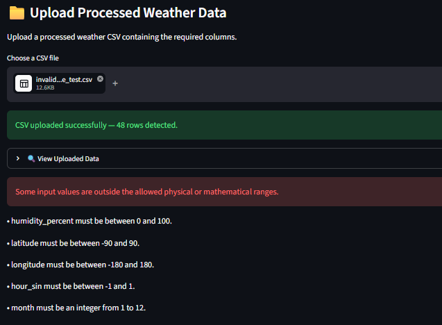
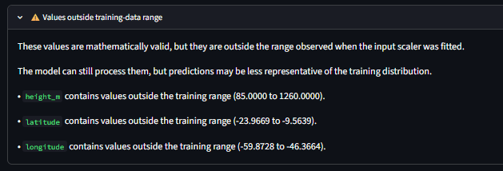

# Short-Term Air Temperature Prediction Using Deep Learning

A deep learning-based project for **short-term air temperature prediction** using hourly weather observations from Brazilian weather stations.

The project covers the complete machine learning workflow - from **data preprocessing and feature engineering to deep learning model development, evaluation, and deployment through a Streamlit web application**.

---

## Project Overview

Weather conditions change continuously and are influenced by several factors such as temperature, humidity, pressure, wind, solar radiation, and time of the day.

In this project, historical weather observations are used to predict the **next-hour air temperature**. Different deep learning architectures are developed and compared, followed by a proposed **Residual Multi-Scale CNN–BiLSTM with Dual Attention** model.

A Streamlit application is also developed to provide a simple interface for uploading weather data, validating it, and generating temperature predictions.

---

## Objectives

- Clean and preprocess large-scale hourly weather data.
- Handle missing and invalid weather observations.
- Create temperature lag features to capture recent temperature behavior.
- Apply temporal and cyclical feature engineering.
- Convert weather observations into sequential data for deep learning.
- Compare different RNN-based architectures.
- Develop a CNN-BiLSTM model with residual connections and attention.
- Evaluate model performance using regression metrics.
- Build a user-friendly Streamlit application for model inference.
- Add input validation to identify incorrect or unusual data.

---

## Dataset

The project uses the **Climate Weather Surface of Brazil - Hourly** dataset containing observations from Brazilian weather stations.

After preprocessing, the final dataset contains approximately **926K observations** and 17 columns.

### Target Variable

`air_temp_c`

Represents air temperature in degrees Celsius.

### Model Input Features

The final model uses 16 features:

```text
temp_lag_1
temp_lag_2
temp_lag_3
dew_point_temp_c
solar_radiation_kj_m2
humidity_percent
pressure_station_mb
wind_speed_mps
height_m
latitude
longitude
hour_sin
hour_cos
doy_sin
doy_cos
month
```

---

## Data Processing

The major preprocessing steps include:

- Replacing invalid placeholder values such as `-9999` with missing values.
- Removing records where the target temperature is unavailable.
- Handling missing weather observations.
- Filling appropriate variables such as solar radiation where applicable.
- Creating temperature lag features.
- Interpolating numerical weather variables by station.
- Applying physical validity checks.
- Creating temporal and cyclical features.
- Scaling the input and target variables using `MinMaxScaler`.

---

## Temporal Feature Engineering

Weather data contains strong daily and seasonal patterns. Cyclical encoding was therefore applied to time-related variables.

For example:

```text
hour → hour_sin, hour_cos
day of year → doy_sin, doy_cos
```

This allows the model to represent the cyclic nature of time, such as the relationship between the end and beginning of a day or year.

---

## Sequence Preparation

The model does not process individual weather records independently.

A **24-observation sequence** is created for each prediction.

```text
24 hourly observations
        ↓
16 features per observation
        ↓
      Model
        ↓
Next-hour air temperature
```

Therefore, the model input has the shape:

```text
24 × 16
```

---

## Deep Learning Models

Several architectures were implemented and compared:

- **GRU**
- **LSTM**
- **BiLSTM**
- **BiLSTM + Additive Attention**
- **BiLSTM + Temporal Attention**
- **Residual Multi-Scale CNN–BiLSTM with Dual Attention**

### Proposed Architecture

The proposed model combines different components to learn temporal weather patterns:

```text
24 × 16 Input Sequence
          ↓
    Multi-Scale CNN
          ↓
   Residual Connections
          ↓
        BiLSTM
          ↓
  Temporal Attention
          ↓
     Dense Layers
          ↓
  Temperature Prediction
```

The CNN layers help capture local patterns, while BiLSTM processes temporal dependencies. Attention allows the model to focus on important time steps.

---

## Custom Loss Function

The proposed model uses a combination of **MAE and Huber Loss**:

```text
Composite Loss = 0.7 × MAE + 0.3 × Huber Loss
```

This provides a combination of absolute-error optimization and a loss function that is more robust to larger errors.

---

## Model Evaluation

The models were evaluated using:

- **MAE** - Mean Absolute Error
- **RMSE** - Root Mean Squared Error
- **MAPE** - Mean Absolute Percentage Error
- **R² Score** - Coefficient of Determination

### Results

| Model | MAE | RMSE | MAPE | R² |
|---|---:|---:|---:|---:|
| GRU | 1.0335 | 1.3981 | 4.38% | 0.9192 |
| LSTM | 0.9338 | 1.2944 | 4.17% | 0.9307 |
| Proposed Model | **0.6155** | **0.9877** | **2.60%** | **0.9597** |

These results are from the held-out test data used during the project.

---

## 💾 Saved Model

The trained model is stored in Keras format:

```text
models/
└── cnn_bilstm_residual_attention_temperature_v8.keras
```

The scalers used during training are also saved:

```text
scalers/
├── scaler_X.pkl
└── scaler_y.pkl
```

Saving the scalers ensures that new input data is transformed consistently with the training data.

---

# Streamlit Web Application

A Streamlit-based interface was developed to make the trained model easier to use.

The application allows users to:

- Upload a processed weather CSV.
- View the uploaded dataset.
- View information about model features.
- Validate input data.
- Detect missing values.
- Detect non-numeric values.
- Check physical value ranges.
- Identify values outside the training-data range.
- Generate the next-hour temperature prediction.
- View the recent temperature trend.

### Application Workflow

```text
Upload CSV
    ↓
Validate Required Columns
    ↓
Check Data Types & Missing Values
    ↓
Validate Physical Ranges
    ↓
Check Training-Data Range
    ↓
Select Latest 24 Observations
    ↓
Scale Input Features
    ↓
Load Trained Model
    ↓
Generate Prediction
    ↓
Convert Prediction Back to °C
```

---

## Application Screenshots

### Application Interface



### Column Information



### Prediction Result



### Input Validation



### Training Range Warning



---

## Testing

The Streamlit application was tested using different CSV test cases to verify both **prediction and input validation**.

| Test Case | Expected Behavior |
|---|---|
| Valid input | Prediction generated |
| Missing column | Input rejected |
| Non-numeric value | Input rejected |
| Missing value | Input rejected |
| Invalid range | Input rejected |
| Outside training range | Warning displayed |
| Fewer than 24 observations | Input rejected |

These test cases are included in the `test_cases/` folder to demonstrate the application's validation and testing workflow.

---

## Project Structure

```text
PredictionofAirTemperature/
│
├── models/
│   └── cnn_bilstm_residual_attention_temperature_v8.keras
│
├── scalers/
│   ├── scaler_X.pkl
│   └── scaler_y.pkl
│
├── screenshots/
│   ├── application-interface.png
│   ├── column-information.png
│   ├── prediction-result.png
│   ├── validation-error.png
│   └── training-range-warning.png
│
├── test_cases/
│   ├── valid_test_data.csv
│   ├── missing_column_test.csv
│   ├── non_numeric_test.csv
│   ├── missing_value_test.csv
│   ├── invalid_range_test.csv
│   ├── training_range_warning_test.csv
│   └── insufficient_rows_test.csv
│
├── app.py
├── final_code_with_results.ipynb
├── requirements.txt
├── .gitignore
└── README.md
```

---

## Technologies Used

**Python**  
**Pandas & NumPy** – Data processing  
**Scikit-learn** – Scaling and preprocessing  
**TensorFlow/Keras** – Deep learning  
**Matplotlib** – Visualization  
**Streamlit** – Web application  
**Joblib** – Saving scalers  
**Git & GitHub** – Version control and project hosting

---

## Run Locally

Clone the repository:

```bash
git clone https://github.com/YOUR_USERNAME/PredictionofAirTemperature.git
cd PredictionofAirTemperature
```

Create a virtual environment:

```bash
python -m venv .venv
```

For Windows:

```bash
.venv\Scripts\activate
```

Install the required packages:

```bash
pip install -r requirements.txt
```

Run the Streamlit application:

```bash
streamlit run app.py
```

---

## Scope and Limitations

This project focuses on **short-term air temperature prediction using the Brazilian weather data used for training and evaluation**.

The reported performance represents the model's results on the held-out test data from the project dataset.

The Streamlit application demonstrates model inference and data validation. Predictions on locations or weather conditions substantially different from the training data may behave differently, which is why the application provides training-range warnings.

---

## Future Scope

- Integrate real-time weather APIs.
- Support additional geographic regions.
- Perform multi-step temperature forecasting.
- Add model explainability.
- Implement automated data ingestion.
- Deploy the application to the cloud.
- Monitor model performance and data drift.

---

## Key Learning Outcomes

This project provided practical experience with an end-to-end deep learning workflow:

- Large-scale weather-data processing
- Data cleaning and validation
- Feature engineering
- Time-series sequence creation
- Feature scaling
- CNN and BiLSTM architectures
- Attention mechanisms
- Custom loss functions
- Model evaluation
- Model serialization
- Streamlit application development
- Git and GitHub

---

## Author

**Korada Neekshith**  
B.Tech - Information Technology  
Aditya Institute of Technology and Management, Tekkali

---

## Summary

This project combines **weather-data preprocessing, temporal feature engineering, deep learning, CNN–BiLSTM architecture, attention mechanisms, and model evaluation** to predict short-term air temperature.

The trained model is integrated into a **Streamlit web application** with data validation and an easy-to-use prediction interface, providing an end-to-end demonstration from weather data to model-based prediction. 
